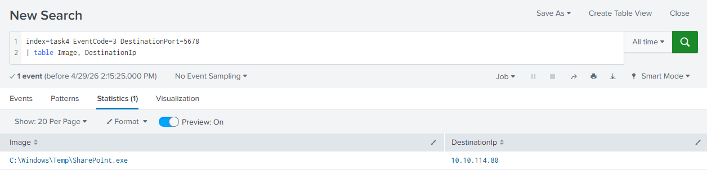
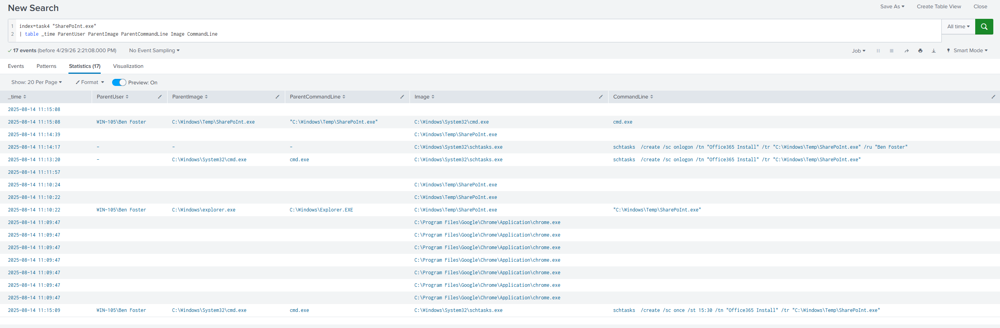
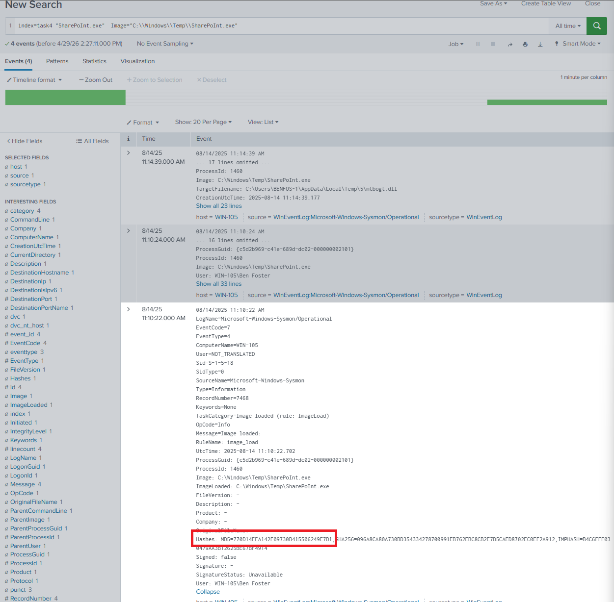
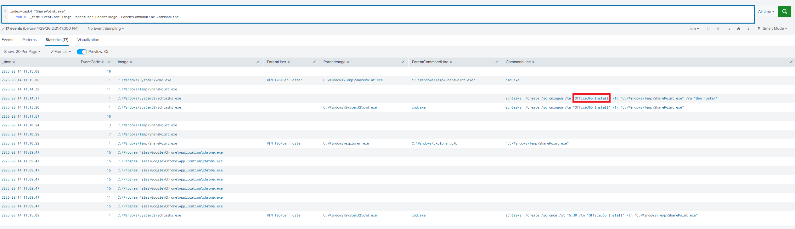

# SOC Investigation Report: Host WIN-105 Compromise

**Platform:** TryHackMe | Log Analysis with SIEM  
**Severity:** Critical

---

## 1. Executive Summary
As a Beginner in SOC Analyst, I investigated a security alert regarding suspicious network traffic on **port 5678** on host `WIN-105`. Forensic analysis in Splunk allowed for the reconstruction of the incident lifecycle, confirming that the system was compromised through the execution of an unauthorized malicious application, which subsequently established an external Command and Control (C2) connection and implemented persistence mechanisms within the operating system.

---

## 2. Technical Analysis and Timeline
The investigation followed a chronological order to map the threat's behavior:

### Initial Infection Vector and Network Activity
Analysis of network logs (`EventCode=3`) revealed anomalous outbound traffic originating from host `WIN-105`. It was confirmed that a connection was established to the IP address **10.10.114.80** over port 5678.



### Malicious Process Execution
By correlating network traffic with process execution logs, I identified that the connection was initiated by the executable **`C:\Windows\Temp\SharePoInt.exe`**. The fact that an unknown process was executed from the `C:\Windows\Temp` directory is a clear indicator of malicious activity designed to evade standard monitoring mechanisms.



### Identification of IoC
For threat intelligence and mitigation purposes, I verified the MD5 hash of the malicious file to ensure unique identification across security systems. The extracted hash is **770D14FFA142F09730B415506249E7D1**.



### Persistence Establishment
To ensure the threat remained active after system reboots, the attacker utilized the `SharePoInt.exe` process to invoke `schtasks.exe` and create a malicious scheduled task named **`Office365 Install`**.



---

## 3. SIEM Queries (SPL)
For audit and investigation replication purposes, the following queries were fundamental:

* **Identification of suspicious connections:**
  ```splunk
  index=task4 EventCode=3 DestinationPort=5678 
  | table Image, DestinationIp
* **Investigation of the process that began:**
  ```splunk
    index=task4 "SharePoint.exe" 
    | table _time ParentUser ParentImage ParentCommandLine Image CommandLine
* **Hash verification:**
  ```splunk
    index=task4 "SharePoint.exe" Image="C:\\Windows\\Temp\\SharePoint.exe"