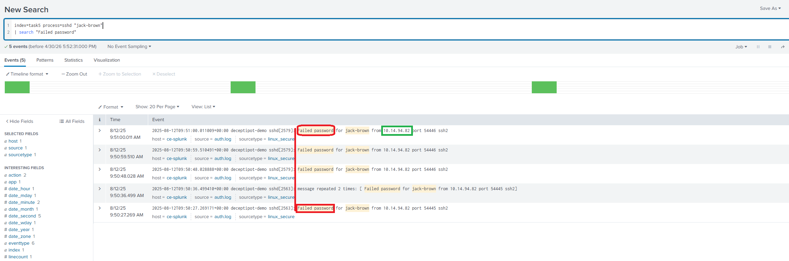
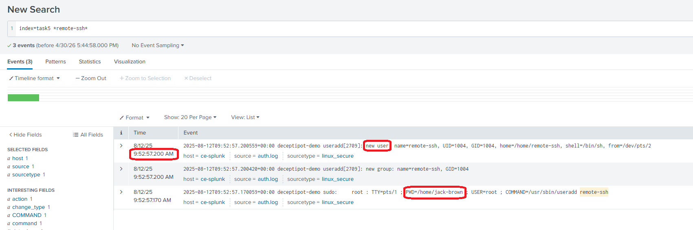
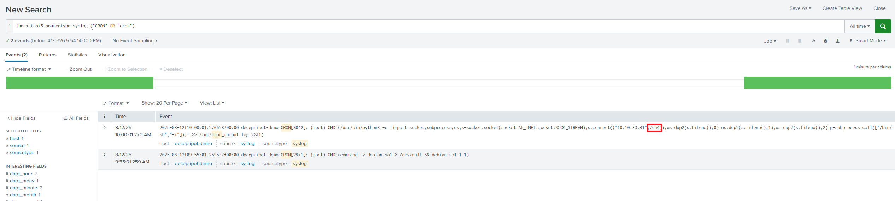

# SOC Investigation Report: Linux Persistence & Privilege Escalation

**[SOC Lab Report: SSH Brute-Force & Cron Persistence Detection]**  
**Summary:** Investigated an unauthorized privilege escalation and persistence establishment on an Ubuntu server. Successfully identified a brute-force attack targeting the `jack-brown` account, tracked the subsequent root escalation used to create a backdoored user, and uncovered a Python-based reverse shell configured via Cron.

---

## 1. Executive Summary
As a Beginner SOC Analyst, I investigated an alert regarding the creation of a suspicious account named `remote-ssh`. Forensic analysis of the Linux authentication and system logs confirmed that an attacker performed a successful brute-force attack against a standard user, escalated privileges to root, and established persistence using both a new user account.

---

## 2. Technical Analysis and Timeline

### 2.1. Initial Access: SSH Brute-Force Attack
The investigation began by analyzing SSH login attempts. I identified an IP address performing multiple login attempts, resulting in several "Failed password" events before a final successful authentication.
* **IP Address:** The attacker successfully authenticated from the IP **`10.14.94.82`**.
* **Failed Attempts:** There were **4 failed login attempts** recorded for the user `jack-brown` prior to the successful compromise.



### 2.2. Privilege Escalation to Root
Once the `jack-brown` account was compromised, the attacker sought higher privileges to perform administrative actions.
* **Privilege Escalation:** The user **`jack-brown`** successfully escalated privileges to root using `sudo`.
* **Context:** The logs show the command execution originating from the home directory `/home/jack-brown`.

### 2.3. Persistence: Account Creation
With root access, the attacker created a new user to maintain a secondary access point to the server.
* **User Created:** A new account named **`remote-ssh`** was added to the system.
* **Timestamp:** The account was created on **2025-08-12 at 09:52:57.200 AM**.



### 2.4. Persistence: Scheduled Reverse Shell (Cron)
Further investigation of system logs revealed a secondary persistence mechanism involving a scheduled task (Cron job).
* **Mechanism:** A Python-based reverse shell was identified within the Cron logs.
* **Connection Port:** The script is configured to connect back to the attacker on port **`7654`**.



---

## 3. SIEM Queries (SPL)

* **Analyzing SSH brute-force activity:**
  ```splunk
  index=task5 process=sshd "jack-brown" "Failed password"
* **Tracking account creation and sudo usage:**
  ```splunk
    index=task5 *remote-ssh*
* **Identifying network-based persistence in Cron:**
  ```splunk
    index=task5 sourcetype=syslog ("CRON" OR "cron")
